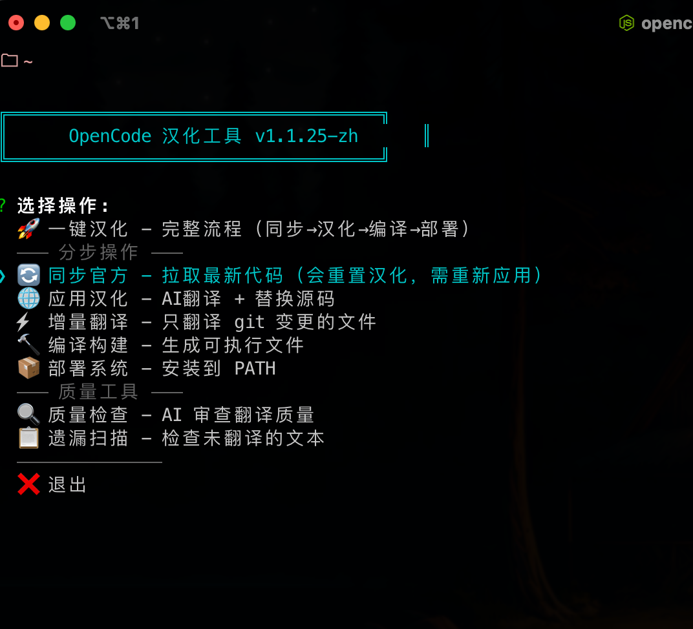
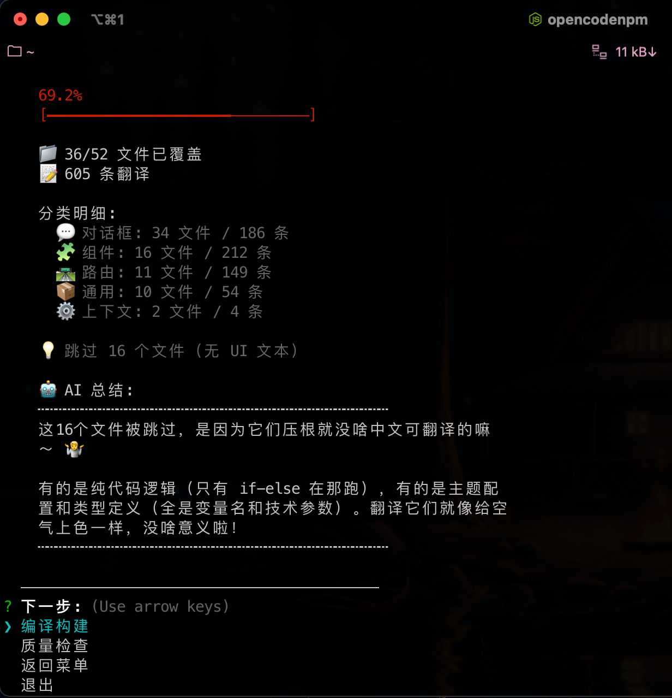
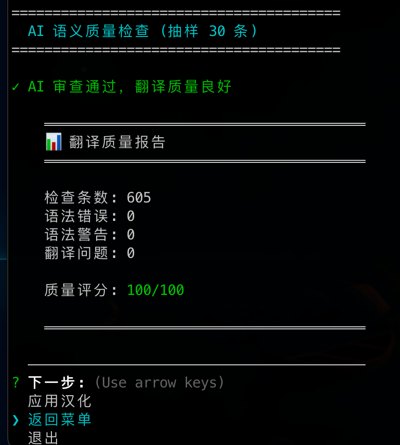

# OpenCode 中文汉化版

[](LICENSE)

> **OpenCode** 是由 [Anomaly Company](https://anomaly.company/) 开发的开源 AI 编程代理。
> 
> 本项目提供完整的中文本地化，通过 AI 辅助翻译和质量检查实现高质量汉化。

---

## 效果展示

| 交互式菜单 | 覆盖率报告 | 质量检查 |
|:---:|:---:|:---:|
|  |  |  |

---

## 快速开始

```bash
# 1. 克隆项目
git clone https://github.com/xiaolajiaoyyds/OpenCodeChineseTranslation.git
cd OpenCodeChineseTranslation

# 2. 安装管理工具
cd scripts && npm install && npm link

# 3. 运行汉化（交互式菜单）
opencodenpm

# 4. 编译运行
opencodenpm build
opencodenpm deploy
opencode
```

---

## 命令参考

| 命令 | 说明 |
|------|------|
| `opencodenpm` | 交互式菜单 |
| `opencodenpm full` | 一键汉化（同步→翻译→编译→部署） |
| `opencodenpm sync` | 同步官方源码 |
| `opencodenpm apply` | 应用汉化 |
| `opencodenpm apply --incremental` | 增量翻译 |
| `opencodenpm check --quality` | 质量检查 |
| `opencodenpm build` | 编译构建 |
| `opencodenpm deploy` | 部署到系统 |
| `opencodenpm env` | 检查环境 |

---

## AI 翻译配置

创建 `.env` 文件：

```env
OPENAI_API_KEY=your-api-key
OPENAI_API_BASE=http://127.0.0.1:8045/v1
OPENAI_MODEL=claude-sonnet-4-20250514
```

### 推荐：Antigravity Tools

使用 [Antigravity Tools](https://agtools.cc) 本地反代，支持 Claude、GPT、Gemini 等多种模型。

---

## 项目结构

```
OpenCodeChineseTranslation/
├── scripts/              # 管理工具
│   ├── core/             # 核心模块（translator.js, i18n.js, menu.js）
│   └── commands/         # CLI 命令
├── opencode-i18n/        # 语言包（605 条翻译）
│   ├── dialogs/          # 对话框（34 文件 / 186 条）
│   ├── components/       # 组件（16 文件 / 212 条）
│   ├── routes/           # 路由（11 文件 / 149 条）
│   ├── common/           # 通用（10 文件 / 54 条）
│   └── contexts/         # 上下文（2 文件 / 4 条）
└── opencode-zh-CN/       # OpenCode 源码（自动克隆）
```

---

## 环境要求

- Node.js >= 18
- Bun >= 1.3
- Git

---

## 更新日志

### [6.1] - 2026-01-18

**文档**
- 更新 README，添加截图和详细说明
- 详细说明 Antigravity Tools 配置

### [6.0] - 2026-01-17

**新增**
- AI 自动翻译（集成到 apply 命令）
- 增量翻译：`opencodenpm apply --incremental`
- 质量检查：`opencodenpm check --quality`
  - 本地语法检查（引号、花括号、标签匹配）
  - AI 语义审查（抽样 30 条）
  - 自动修复语法问题
- 交互式菜单优化
- 覆盖率报告 + AI 智能总结

**改进**
- 翻译格式统一为 `中文 (English)` 双语格式
- Node.js CLI 替代 PowerShell，跨平台支持

**修复**
- 修复 28 处翻译语法问题
- 修复菜单 stdin 事件监听冲突

**统计**
- 605 条翻译，质量评分 100/100

### [5.x] - 历史版本

由原作者 [1186258278](https://github.com/1186258278) 维护，主要功能：模块化汉化配置、PowerShell 管理脚本。

---

## 许可证

MIT License | OpenCode 原项目版权归 [Anomaly Company](https://anomaly.company/) 所有

---

## 链接

- [OpenCode 官方](https://github.com/anomalyco/opencode)
- [Antigravity Tools](https://agtools.cc)

---

## 致谢

本汉化项目基于 [1186258278](https://github.com/1186258278) 的工作进行维护和改进。
