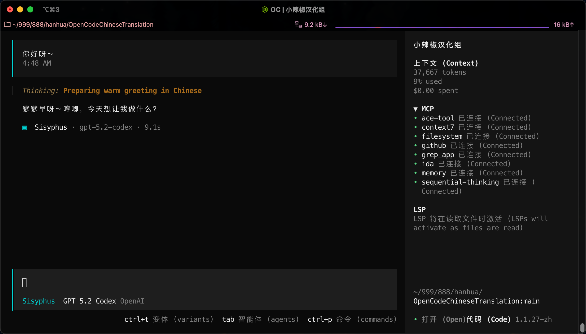
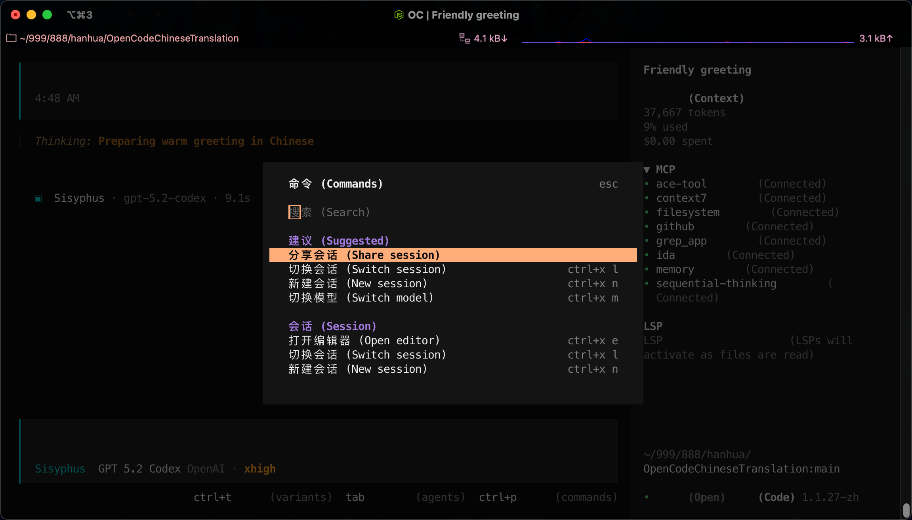
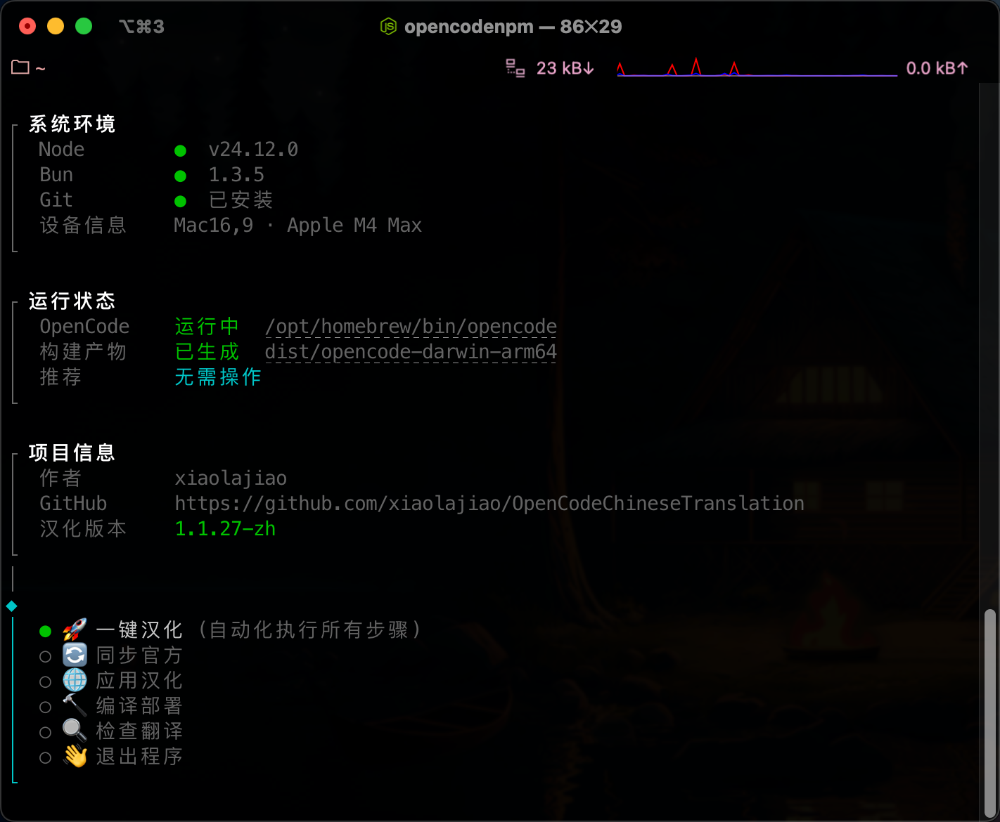
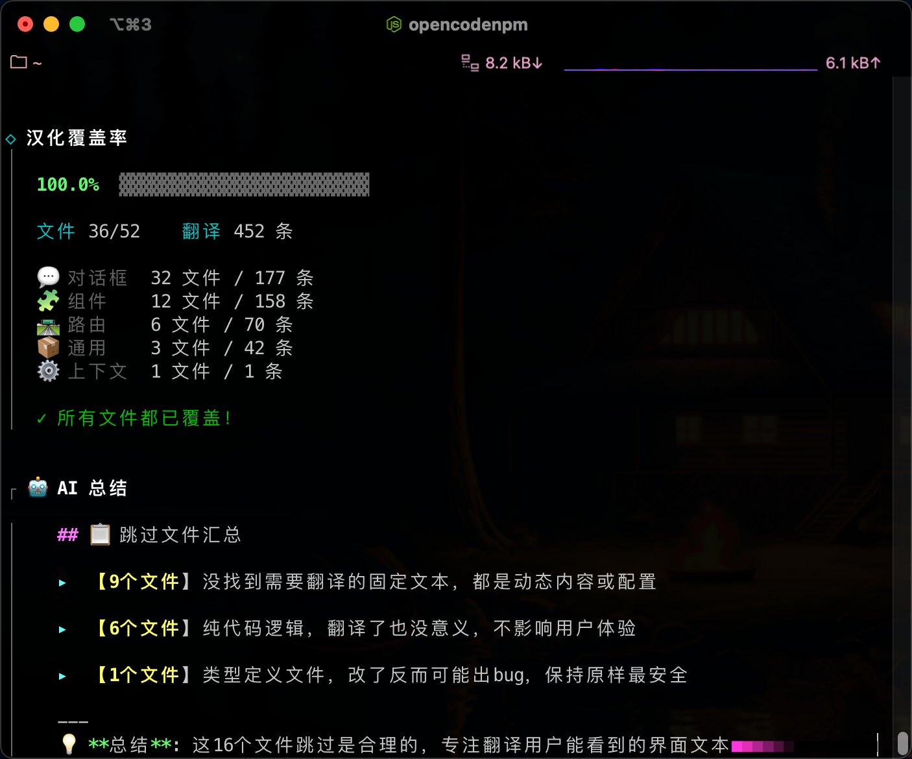
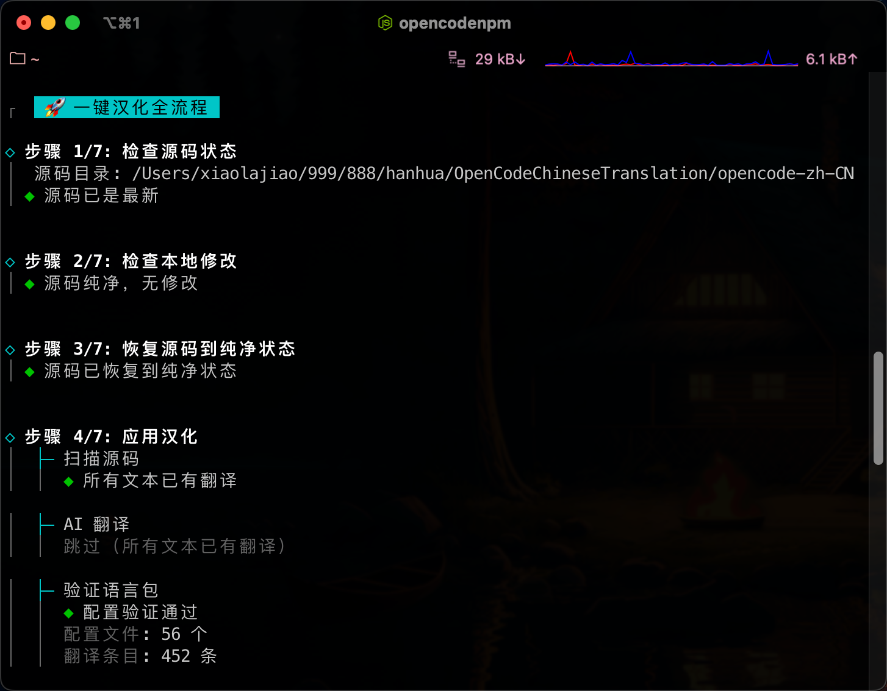
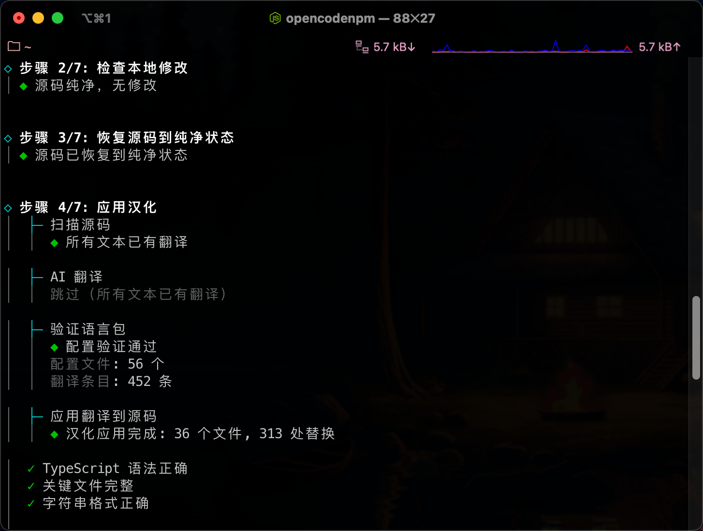
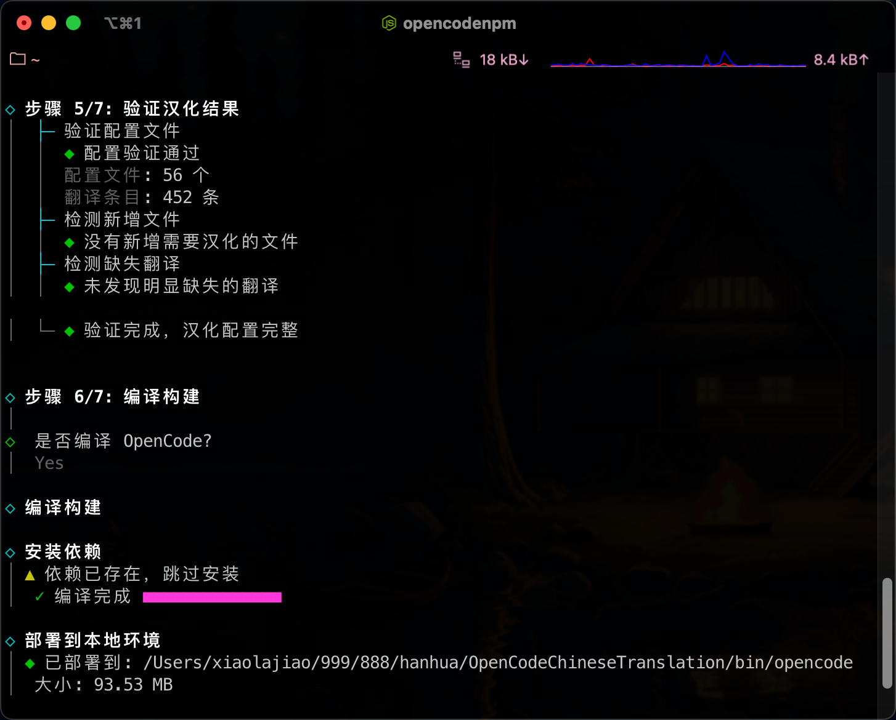
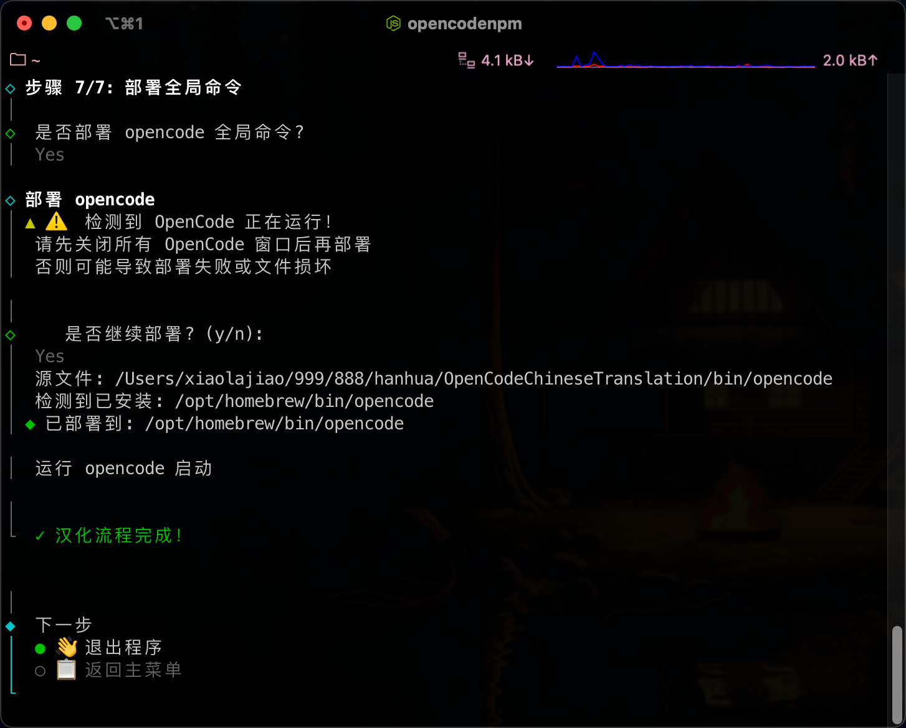
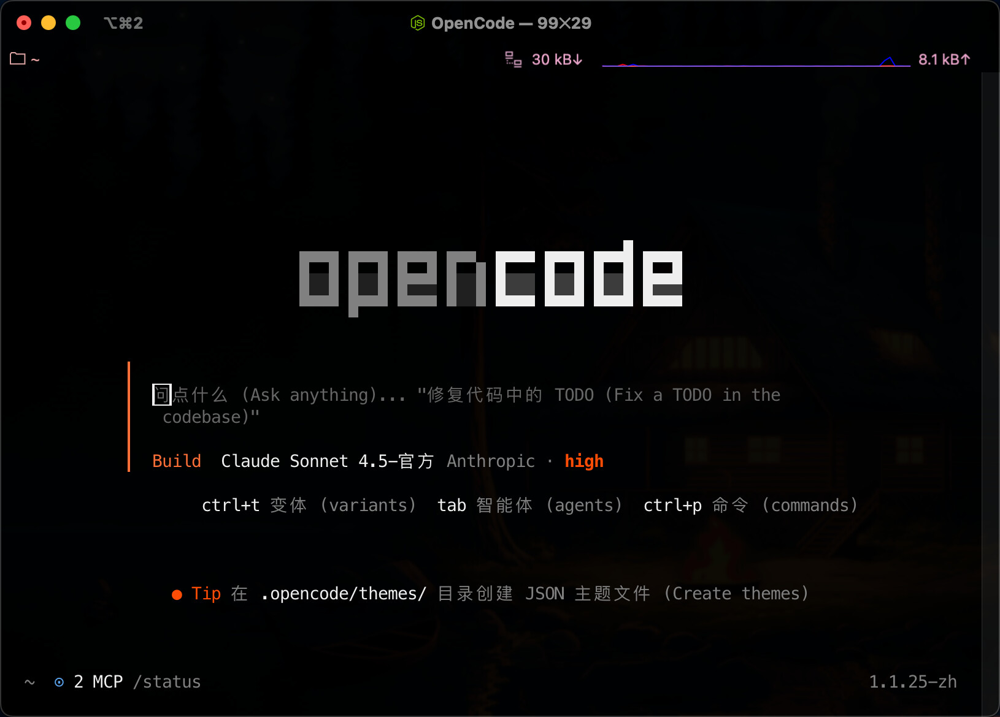

# OpenCode 中文汉化版 v1.1.31-zh

[](LICENSE)
[](https://github.com/anomalyco/opencode)
[](https://github.com/xiaolajiaoyyds/OpenCodeChineseTranslation)

> **OpenCode** 是由 [Anomaly Company](https://anomaly.company/) 开发的开源 AI 编程代理。
> 本项目提供完整的中文本地化，通过 AI 辅助翻译和质量检查实现高质量汉化。

---

## 📌 项目说明

基于 [@QinTian 的汉化项目](https://linux.do/t/topic/1469651) 进行改进。

### 为什么做这个项目？

**由于 OpenCode 官方更新频繁，每次都会新增文件，手动翻译太累了！**

于是花了半天时间搞了个自动化方案：

- ✅ AI 自动检测新文本并翻译
- ✅ AI 审查防止翻译错误导致源文件报错
- ✅ 支持增量翻译，只翻译 git 变更文件
- ✅ 质量检查 + 自动修复
- ✅ 覆盖率报告 + AI 智能总结
- ✅ GitHub Actions 自动构建多平台版本

**现在不怕官方更新了，AI 会自动搞定翻译！**

---

## 🎯 核心功能

| 功能 | 说明 |
|------|------|
| **一键汉化** | `opencodenpm full` 自动完成同步→翻译→编译→部署全流程 |
| **AI 自动翻译** | 官方更新后自动检测新文本，调用 AI 翻译 |
| **增量翻译** | `opencodenpm apply --incremental`，仅翻译 git 变更文件 |
| **质量检查** | `opencodenpm check --quality`，语法检查 + AI 语义审查 |
| **自动修复** | 发现语法问题时 AI 自动修复 |
| **多平台构建** | GitHub Actions 自动构建 macOS/Linux/Windows 版本 |

---

## ✨ v1.1.31-zh 新特性

### 🎨 界面优化

- **AI 总结合并**：AI 总结不再单独开框，合并到执行总结框内最后，界面更简洁
- **输出顺序优化**：覆盖率报告 → 执行总结（含 AI 总结）→ 完成提示，流程更自然
- **模型信息对齐**：AI 总结中"指定模型"使用 L3 格式，与其他信息对齐

### 🔧 技术改进

- printPipelineSummary 改为 async 函数，支持 AI 总结的异步调用
- generateCoverageSummaryInline 新增内联版本，不创建独立框
- 修复 AI 总结最后一行与结束符混在一起的问题

---
- **智能换行**：只在标点符号后断行，避免中文断字
- **用户体验**：AI 语义质量检查添加可选确认（Yes/No），节省 API 消耗

### 🔧 工具改进

- **静默模式支持**：deployer.js 添加 silent 参数，支持后台静默部署
- **交互式菜单**：系统环境、运行状态、项目信息一目了然
- **输出风格统一**：全面匹配 @clack/prompts 视觉风格
- **跨平台支持**：Node.js CLI 替代 PowerShell，macOS/Linux/Windows 通用

---

## 🖼️ 效果展示

### 汉化后的 OpenCode

|              主界面              |              命令菜单               |
| :------------------------------: | :---------------------------------: |
|  |  |

### 汉化工具界面

|          交互式菜单           |           覆盖率 + AI 总结           |
| :---------------------------: | :----------------------------------: |
|  |  |

### 一键汉化全流程

|             步骤 1-4             |             步骤 4-5             |             步骤 5-7             |
| :------------------------------: | :------------------------------: | :------------------------------: |
|  |  |  |

|              部署完成              |
| :--------------------------------: |
|  |

---

## 🚀 快速开始

### 方式一：下载预编译版本（推荐）

## 如果你这台电脑什么都没有安装，环境也不会，那么我建议你直接下载安装把。一键启动。
## 启动后，可以用内置免费的ai,然后让 ai 进行环境安装，还是做什么。

前往 [Releases](https://github.com/xiaolajiaoyyds/OpenCodeChineseTranslation/releases) 下载对应平台的预编译版本：

| 平台 | 文件 |
|------|------|
| macOS (Apple Silicon) | `opencode-darwin-arm64.tar.gz` |
| macOS (Intel) | `opencode-darwin-x64.tar.gz` |
| Linux (x64) | `opencode-linux-x64.tar.gz` |
| Windows (x64) | `opencode-windows-x64.zip` |

```bash
# macOS/Linux 安装
tar -xzf opencode-<platform>.tar.gz
sudo mv opencode-<platform>/bin/opencode /usr/local/bin/
```

### 方式二：从源码编译

```bash
# 1. 克隆项目
git clone https://github.com/xiaolajiaoyyds/OpenCodeChineseTranslation.git
cd OpenCodeChineseTranslation

# 2. 安装依赖
cd scripts && npm install && npm link

# 3. 运行汉化（交互式菜单）
opencodenpm

# 4. 或一键汉化
opencodenpm full
```

---

## 📊 翻译统计

- **452 条翻译**，覆盖率 **100%**
- 对话框：32 文件 / 177 条
- 组件：12 文件 / 158 条
- 路由：6 文件 / 70 条
- 通用：3 文件 / 42 条
- 上下文：1 文件 / 1 条

---

## 🔧 AI 翻译配置

创建 `.env` 文件（支持任何 OpenAI 兼容 API）：

```env
OPENAI_API_KEY=your-api-key
OPENAI_API_BASE=http://127.0.0.1:8045/v1
OPENAI_MODEL=claude-sonnet-4-20250514
```

### 推荐：Antigravity Tools

使用 [Antigravity Tools](https://agtools.cc) 本地反代，支持 Claude、GPT、Gemini 等多种模型。



---

## 📝 命令参考

| 命令 | 说明 |
|------|------|
| `opencodenpm` | 交互式菜单（推荐） |
| `opencodenpm full` | 一键汉化（同步→翻译→编译→部署） |
| `opencodenpm sync` | 同步官方源码 |
| `opencodenpm apply` | 应用汉化 |
| `opencodenpm apply --incremental` | 增量翻译（只翻译 git 变更） |
| `opencodenpm check --quality` | 质量检查（语法 + AI 审查） |
| `opencodenpm build` | 编译构建 |
| `opencodenpm deploy` | 部署到系统 |

---

## ⚙️ OpenCode 配置文件

> **配置文件位置**：`~/.config/opencode/`
> 所有配置文件保存在用户根目录，**更新项目不会丢失配置**。

| 文件 | 作用 | 示例 |
|------|------|------|
| `AGENTS.md` | AI 助手身份定义 | [`docs/AGENTS.example.md`](docs/AGENTS.example.md) |
| `global-rules.md` | 开发规范与工具指南 | [`docs/global-rules.example.md`](docs/global-rules.example.md) |
| `oh-my-opencode.json` | 插件配置 | [`docs/oh-my-opencode.example.json`](docs/oh-my-opencode.example.json) |
| `opencode.json` | OpenCode 主配置 | [`docs/opencode.example.json`](docs/opencode.example.json) |

---

## ❓ 常见问题

<details>
<summary><b>Q: 配置文件会不会丢失？</b></summary>

不会！所有配置文件保存在用户根目录 `~/.config/` 下，更新项目不会影响配置。

```bash
# 建议定期备份
cp -r ~/.config/opencode ~/backup-opencode-config
```

</details>

<details>
<summary><b>Q: 官方更新后如何同步？</b></summary>

```bash
opencodenpm sync                    # 同步官方源码
opencodenpm apply --incremental     # 增量翻译
opencodenpm build && opencodenpm deploy
```

</details>

<details>
<summary><b>Q: 发现翻译错误怎么办？</b></summary>

1. 手动修改 `opencode-i18n/` 下的语言包文件
2. 运行 `opencodenpm check --quality` 检查质量
3. 提交 PR 到项目仓库

</details>

---

## 📦 项目结构

```
OpenCodeChineseTranslation/
├── .github/workflows/    # GitHub Actions 自动构建
├── scripts/              # 管理工具
│   ├── core/             # 核心模块（translator.js, i18n.js, menu.js）
│   └── commands/         # CLI 命令
├── opencode-i18n/        # 语言包（452 条翻译）
│   ├── dialogs/          # 对话框（32 文件 / 177 条）
│   ├── components/       # 组件（12 文件 / 158 条）
│   ├── routes/           # 路由（6 文件 / 70 条）
│   ├── common/           # 通用（3 文件 / 42 条）
│   └── contexts/         # 上下文（1 文件 / 1 条）
└── opencode-zh-CN/       # OpenCode 源码（自动克隆）
```

---

## 📋 更新日志

### v1.1.28-zh (2026-01-21)

**TUI 视觉体验全面升级**

- ✨ 统一 TUI 输出系统（连接线青色、徽章 `●`、日志整洁）
- 🌠 Knight Rider 流星动画（14 格粉色渐变尾巴）
- 🎨 AI 总结格式化（`▸` 青色、`【】` 黄色高亮）
- 📝 智能换行（只在标点后断行）
- 🔧 GitHub Actions 自动构建多平台版本

### v1.1.25-zh (2025-01-18)

- 🚀 初始版本发布
- AI 自动翻译 + 增量翻译
- 质量检查 + 自动修复
- 覆盖率报告 + AI 智能总结
- 跨平台支持（macOS/Linux/Windows）

---

## ❓ 常见问题

### 编译错误：找不到模块或语法错误

**问题现象：**
```
error: Could not resolve: "./dialog-session - 重命名"
error: Unexpected token, expected ","
```

**原因：** 使用了旧版本或有问题的汉化配置文件。

**解决方案：**
```bash
# 1. 更新到最新版本
cd OpenCodeChineseTranslation
git pull origin main

# 2. 恢复官方源码纯净状态
cd opencode-zh-CN/packages/opencode
git checkout -- .

# 3. 重新执行汉化
cd ../../../
node scripts/bin/opencodenpm sync
node scripts/bin/opencodenpm full
```

**预防措施：**
- 定期执行 `git pull origin main` 更新汉化工具
- 不要手动修改 `opencode-i18n/` 目录中的配置文件
- 使用 `sync` 命令确保源码和汉化同步

---

### 汉化工具版本检查

```bash
# 查看当前版本
opencodenpm --version

# 检查是否有更新
cd OpenCodeChineseTranslation
git log --oneline -1
```

如果本地版本低于 `v1.1.31-zh`，请立即更新。

---

## 🔗 相关链接

- **项目地址**: https://github.com/xiaolajiaoyyds/OpenCodeChineseTranslation
- **OpenCode 官方**: https://github.com/anomalyco/opencode
- **Antigravity Tools**: https://agtools.cc
- **原汉化项目**: [QinTian 的帖子](https://linux.do/t/topic/1469651)
- **Oh-My-OpenCode**: https://github.com/code-yeongyu/oh-my-opencode

---

## 📜 许可证

MIT License | OpenCode 原项目版权归 [Anomaly Company](https://anomaly.company/) 所有

---

## 🙏 致谢

本汉化项目基于 [1186258278](https://github.com/1186258278) 和 [@QinTian](https://linux.do/t/topic/1469651) 的工作进行维护和改进。

感谢所有贡献者和使用者的支持！

---

## 📮 问题反馈

有问题欢迎在 [Issues](https://github.com/xiaolajiaoyyds/OpenCodeChineseTranslation/issues) 留言~

**在报告问题前，建议先备份配置文件！**
