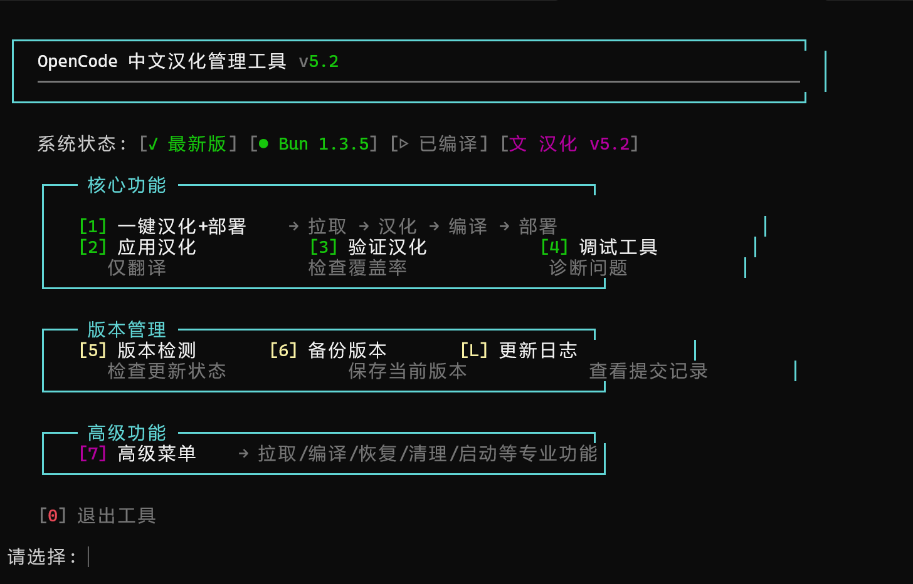
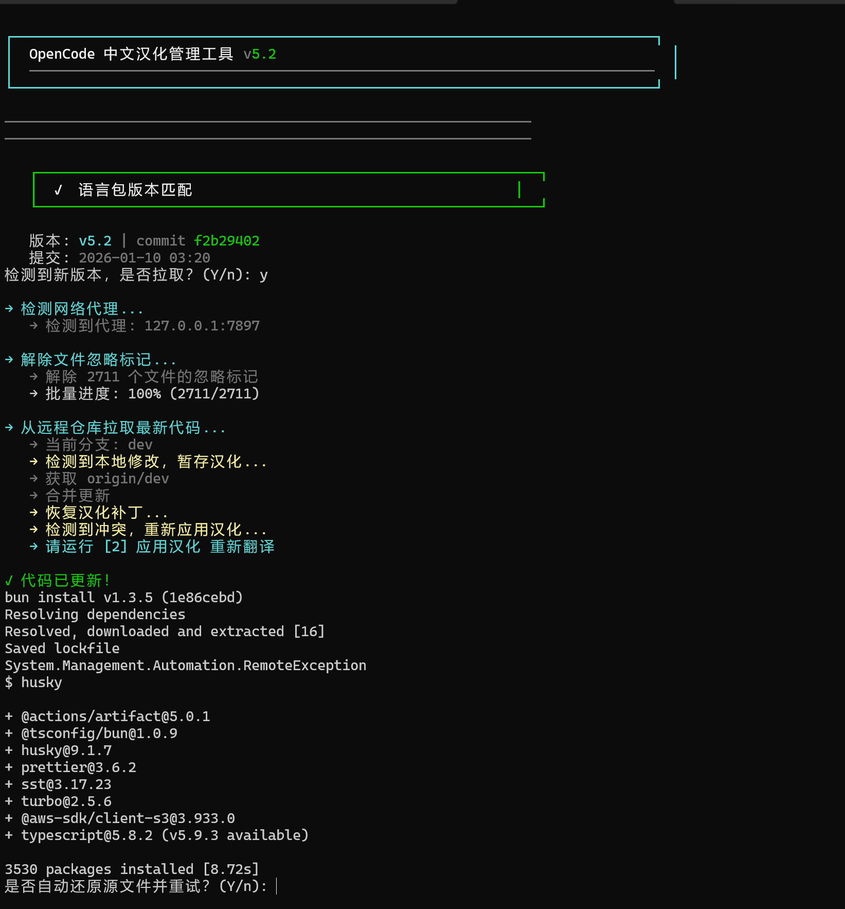
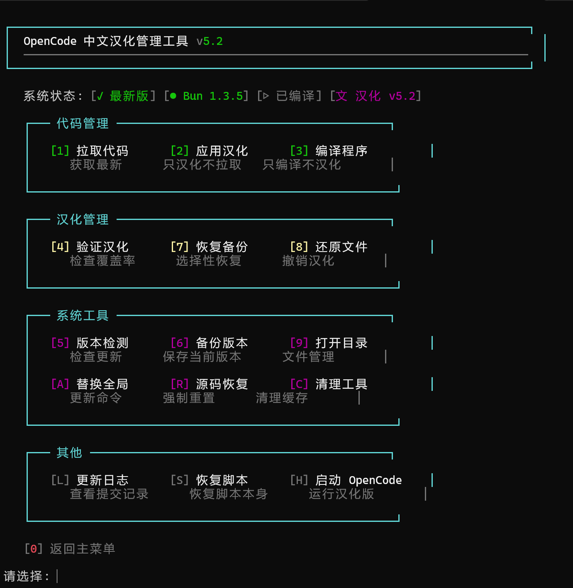

# 功能演示 / Feature Showcase

本文档展示 OpenCode 中文汉化工具的功能和界面。

This document showcases the features and interface of the OpenCode Chinese Localization Tool.

---

[中文](#中文文档) | [English](#english-documentation)

---

## 中文文档

### 主菜单界面

运行 `.\scripts\opencode.ps1` 后，您会看到主菜单：

```
╔════════════════════════════════════╗
║  OpenCode 中文汉化管理工具 v4.0    ║
╚════════════════════════════════════╝

  版本: 61aeb2a2 (feat: Polish dialog...)
  编译: 刚刚

  [1]  一键汉化+部署
      → 自动拉取代码 → 应用汉化 → 编译 → 部署

  [2]  验证汉化      [3]  调试工具
      检查汉化效果          诊断问题

  [4]  版本检测      [5]  备份版本      [L]  更新日志
      检查更新状态          保存当前版本          查看提交记录

  [6]  高级菜单
      → 更多专业功能（拉取/编译/恢复/清理等）

  [0]  退出
```

### 更新日志功能

按 `[L]` 进入更新日志，查看最近15条提交记录：

```
   ┌────────────────────────────────────────────────────────────────────────
   │  #  Hash      │ 作者    │ 时间     │ 变更   │ 消息
   ├────────────────────────────────────────────────────────────────────────
   │  1. [61aeb2a2] │ Amjad  │ (2小时前) │ +120/-5 │ feat: Polish dialog...
   │  2. [4b0f7b82] │ bot    │ (5小时前) │ +3/-0   │ ignore: update stats...
   └────────────────────────────────────────────────────────────────────────

   操作:
     [1-15] 查看提交详情
     [O]    在浏览器中打开最新提交
     [R]    刷新列表
     [0]    返回主菜单
```

### 提交详情页面

选择某个提交后，查看详细信息：

```
   提交详情
   ────────────────────────────────────────────────────────────────

   Commit: 61aeb2a2a
   61aeb2a2a1234567890abcdef1234567890abcdef1234567890abcdef

   作者: Amjad
   时间: 01-09 23:02 (2小时前)

   消息:
   feat: Polish dialog, popover shadows & borders, and other styles

   变更:
   文件: 5 | +120行 | -5行

   文件列表:
     [修改] src/cli/cmd/tui/component/dialog-agent.tsx
     [修改] src/cli/cmd/tui/component/popover.tsx
     [新增] src/styles/shadows.css

   操作:
     [O] 在浏览器中打开
         https://github.com/anomalyco/opencode/commit/61aeb2a2a
     [H] 查看完整 diff
     [0] 返回
```

### 汉化效果预览

汉化后的 OpenCode 界面效果：

| 功能区域 | 原文 | 译文 |
|---------|------|------|
| 命令面板 | "Select a session" | "选择一个会话" |
| 智能体选择 | "Choose an agent" | "选择智能体" |
| 上下文管理 | "Context" | "上下文" |
| MCP 状态 | "MCP Servers" | "MCP 服务器" |
| 权限请求 | "Allow file access?" | "允许访问文件？" |

---

## English Documentation

### Main Menu Interface

After running `.\scripts\opencode.ps1`, you will see the main menu:

```
╔════════════════════════════════════╗
║  OpenCode 中文汉化管理工具 v4.0    ║
╚════════════════════════════════════╝

  [1]  One-Click Localization+Deploy
      → Auto pull → Apply patches → Build → Deploy

  [2]  Verify        [3]  Debug Tools
      Check effects        Diagnose issues

  [4]  Check Version [5]  Backup      [L]  Changelog
      Update status        Save version        View commits

  [6]  Advanced Menu
      → More features (pull/build/restore/clean)

  [0]  Exit
```

### Changelog Feature

Press `[L]` to view changelog with recent 15 commits:

```
   ┌────────────────────────────────────────────────────────────────────────
   │  #  Hash      │ Author  │ Time      │ Changes │ Message
   ├────────────────────────────────────────────────────────────────────────
   │  1. [61aeb2a2] │ Amjad   │ (2h ago)  │ +120/-5 │ feat: Polish dialog...
   │  2. [4b0f7b82] │ bot     │ (5h ago)  │ +3/-0   │ ignore: update stats...
   └────────────────────────────────────────────────────────────────────────

   Actions:
     [1-15] View commit details
     [O]    Open latest commit in browser
     [R]    Refresh list
     [0]    Return to main menu
```

### Translation Preview

| Area | Original | Translated |
|------|----------|------------|
| Command Panel | "Select a session" | "选择一个会话" |
| Agent Selection | "Choose an agent" | "选择智能体" |
| Context | "Context" | "上下文" |
| MCP Status | "MCP Servers" | "MCP 服务器" |
| Permission | "Allow file access?" | "允许访问文件？" |

---

## 界面截图 / Screenshots

### 主菜单 / Main Menu



运行 `.\scripts\opencode.ps1` 后的主界面，提供完整的功能导航。

### 版本不匹配警告 / Version Mismatch Warning



当语言包版本与代码不匹配时，会自动显示提示和建议方案。

### 汉化验证结果 / Verification Results



验证功能会检查所有汉化模块，显示通过/失败状态和详细问题。
