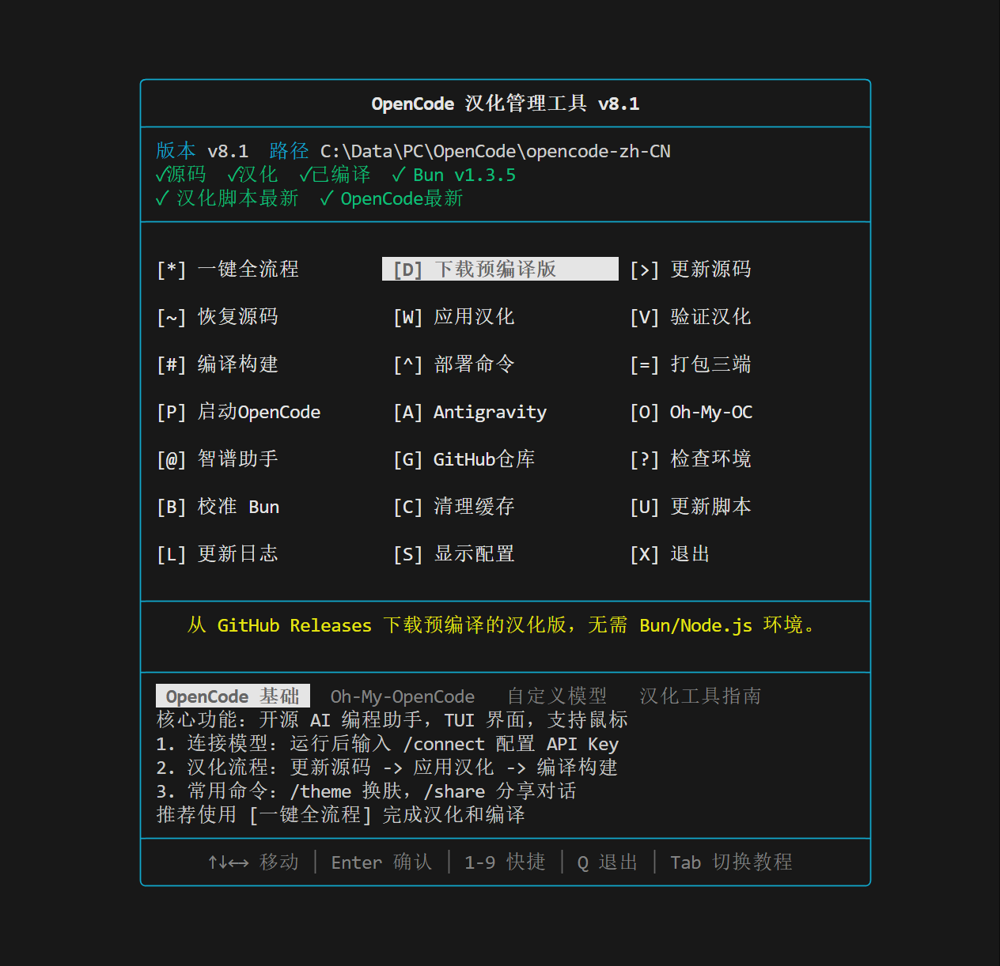
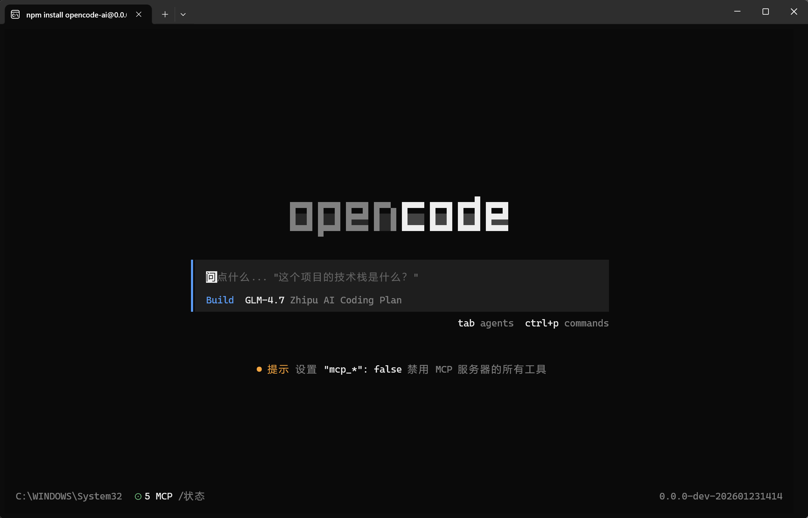
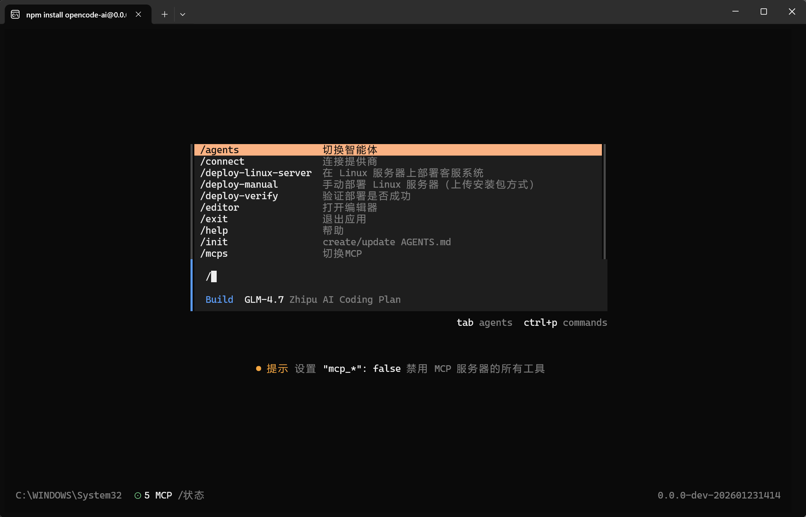
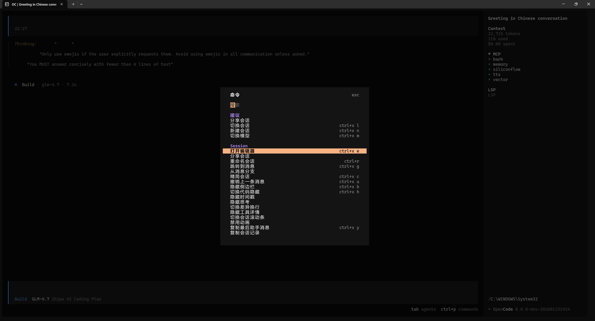
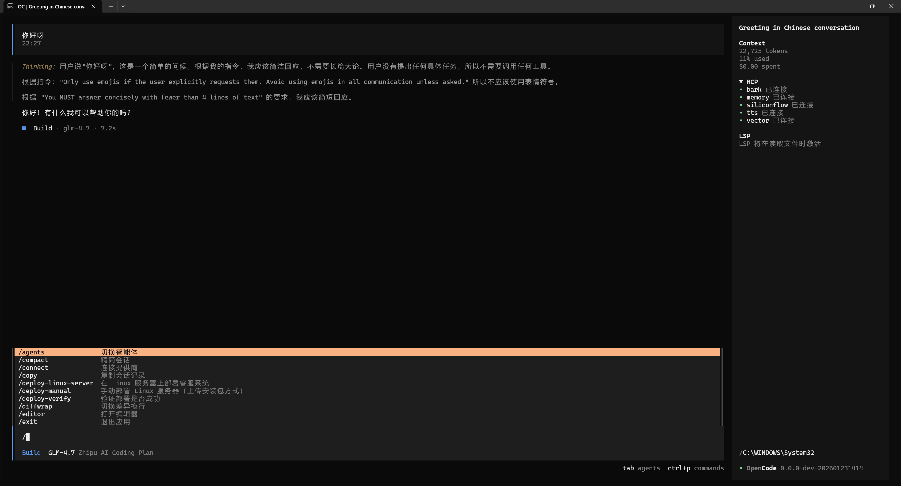

# 功能演示 / Feature Showcase

本文档展示 OpenCode 中文汉化工具的功能和界面截图。

---

## 📸 界面截图

### 1. CLI 管理工具主界面 (01.png)

**OpenCode 汉化管理工具** - 全功能 TUI 界面

- 版本状态实时显示（源码/汉化/编译状态）
- 一键完成：更新 → 汉化 → 编译 → 部署
- 支持 Windows / macOS / Linux 三平台
- 环境检测与 Bun 版本校准

---

### 2. OpenCode 主编辑器界面 (02.png)

**汉化后的 OpenCode 主界面**

- 完整汉化的命令面板和侧边栏
- 会话管理、上下文控制
- 智能体选择与配置
- 沉浸式中文编程体验

---

### 3. 对话框与弹窗 (03.png)

**对话框组件汉化效果**

- 智能体选择对话框
- 模型提供商配置
- 权限请求提示
- 确认与警告弹窗

---

### 4. 设置与配置界面 (04.png)

**设置页面汉化效果**

- 主题切换
- 快捷键配置
- 模型参数调整
- 格式化器设置

---

### 5. MCP 服务器配置 (05.png)

**MCP (Model Context Protocol) 配置界面**

- MCP 服务器状态监控
- 服务添加与管理
- 连接状态指示
- 工具与资源列表

---

## 🎯 汉化覆盖范围

| 模块 | 文件数 | 汉化内容 | 状态 |
|------|--------|----------|------|
| **对话框** | 20 | 所有弹窗、模态框 | ✅ 100% |
| **路由页面** | 6 | 侧边栏、页头、页脚 | ✅ 100% |
| **UI组件** | 6 | 按钮、输入框、提示 | ✅ 100% |
| **通用文本** | 6 | 错误消息、Toast通知 | ✅ 100% |

---

## 📝 术语对照表

| 英文 | 中文 | 说明 |
|------|------|------|
| Agent | 智能体 | AI 代理模式 |
| Session | 会话 | 对话上下文 |
| Provider | 提供商 | 模型服务商 |
| MCP Server | MCP 服务器 | 模型上下文协议服务 |
| Context | 上下文 | 对话历史 |
| Prompt | 提示词 | 输入指令 |
| Stash | 暂存 | 临时保存 |
| Timeline | 时间线 | 操作历史 |

---

> **最后更新**: 2026-01-24  
> **汉化版本**: v8.4.0
